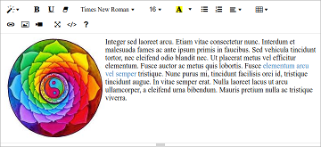
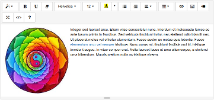
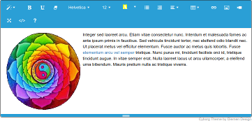
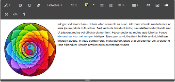
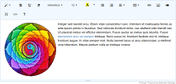

### summernote-themes
Themes for Summernote WYSIWYG Editor Lite Edition

Most of the themes are easily added by swapping out the CSS File in place of the original supplied by the Summernote team.

In this repository we supply a minified, unminified, version using Summernote's Icons, a version using LibreICON Icons (black and colour embedded).

To use the themes simply reference the stylesheet in place of Summernote's stylesheet. Rather than adding another stylesheet to your pages, we though it better to have a complete replacement, which should also minimise conflicts.

#### Default Theme
This is the Default Theme for the summernote-lite Branch.

#### BS3 Theme
This Theme is more akin to the Original Summernote based on Bootstrap 3.

#### Cerulean Theme
This Theme is based on the Bootswatch Cerulean Theme based on Bootstrap 4.

#### Cosmo Theme
This Theme is based on the Bootswatch Cosmo Theme based on Bootstrap 4.

#### Cyborg Theme
This Theme is based on the Bootswatch Cyborg Theme based on Bootstrap 4.

#### Darkly Theme
This Theme is based on the Bootswatch Darkly Theme based on Bootstrap 4.

#### Flatly Theme
This Theme is based on the Bootswatch Flatly Theme based on Bootstrap 4.

#### Plex Theme
This Theme is based on the Theme used by Plex based on Bootstrap 3.

#### Primer Theme
This Theme is based on the Theme used by Github.

More to come...