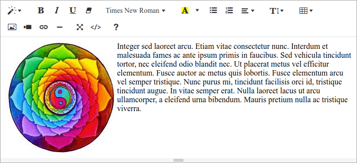
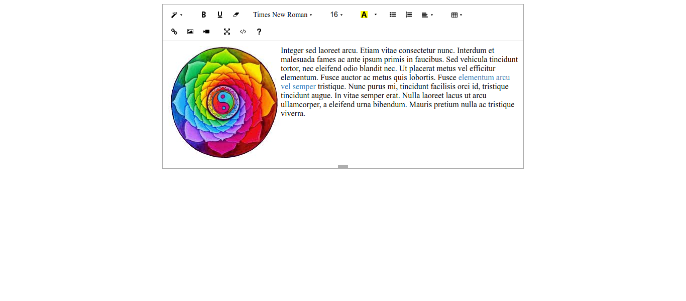
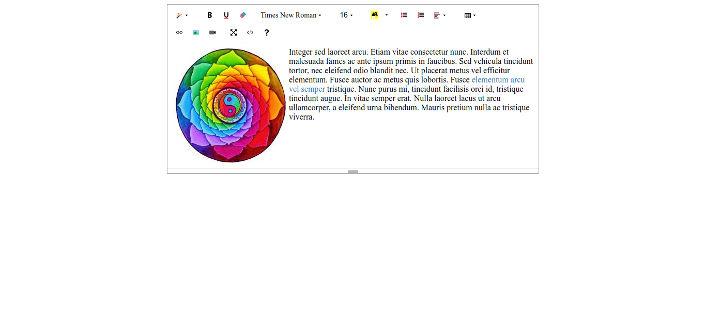

This folder contains the Default theme which can be used as the basis of building your own themes.

summernote-lite-default.css uses the Summernote supplied Icons

summernote-lite-default-libre.css uses the DiemenDesign LibreICONS SVG black&white Icons

summernote-lite-default-libre-col.css uses the DiemenDesign LibreICONS SVG Colour Icons

